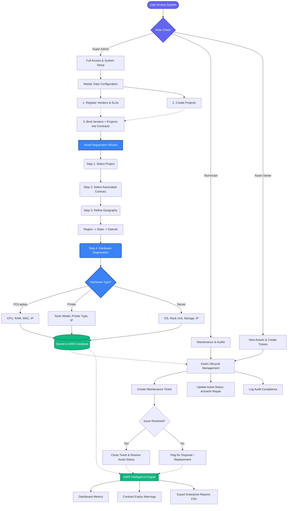

# AIMS (Advanced Inventory Management System) Workflow

Below is the complete architectural workflow of how your AIMS system operates from start to finish, mapped out from user login to asset maintenance and reporting.

## System Phases Explained

1. **Access Control (Roles):** Sistem membezakan kuasa antara *Super Admin* (untuk konfigurasi), *Technician* (untuk selenggara aset), dan *User* biasa.
2. **Setup Data Induk (Master Data):** Sebelum aset dimasukkan, pentadbir (Admin) perlu membina asas organisasi. Vendor dan Polisi SLA didaftarkan, Projek diwujudkan, dan kedua-duanya diikat menghasilkan **Kontrak (Contracts)**.
3. **Pendaftaran Aset (Hardware Wizard):** Ini adalah jantung operasi AIMS. Sistem memaksa pendaftaran dilakukan mengikut hierarki yang ketat: `Projek ➔ Kontrak ➔ Lokasi Geografi ➔ Borang Aset Dinamik`. Data tidak relevan (seperti *Toner* untuk Laptop) disembunyikan.
4. **Kitaran Hayat & Penyelenggaraan:** Aset yang telah hidup di pangkalan data boleh diselenggara menerusi fungsi **Maintenance Tickets**. Juruteknik akan membaik pulih dan mengubah status aset.
5. **Analitik & Kepintaran (Intelligence):** Segala data dari kontrak tamat tempoh, jumlah aset, hinggalah ke kekerapan kerosakan akan disedut oleh pemuka *Dashboard* dan *Reports* untuk menjana data CSV dan amaran awal.
